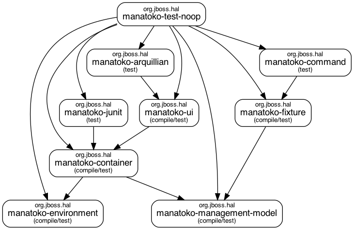

[](https://github.com/hpehl/manatoko/actions/workflows/verify.yml)

Manatoko ([Maori](https://maoridictionary.co.nz/search?keywords=manatoko) for verify, test) is a new approach to test the [HAL](https://hal.github.io) management console. It builds on top of

- [Testcontainers](https://www.testcontainers.org/)
- [Arquillian Graphene 2](http://arquillian.org/arquillian-graphene/) and [Arquillian Drone](http://arquillian.org/arquillian-extension-drone/)
- [JUnit 5](https://junit.org/junit5/)

The goal is that tests should be self-contained. Containers are started and stopped when necessary and tests can focus on testing the UI and verifying management model changes. The biggest advantage of this approach is that it is very easy to run UI tests in a CI environment.

**TOC**
* [Write Tests](#write-tests)
* [Test Environment](#test-environment)
  * [Remote](#remote)
   * [Local](#local)
* [Run Tests](#run-tests)
  * [Run All Tests](#run-all-tests)
  * [Run Specific Tests](#run-specific-tests)
* [Images](#images)
* [Modules](#modules)
* [Scripts](#scripts)

# Write Tests

Tests need to be annotated with two annotations (in this order!):

1. `@Manatoko`: This annotation activates two Junit 5 extensions:
   - `SystemSetupExtension`: Takes care of starting / stopping singleton containers once before / after all tests.
   - `ArquillianExtension`: Takes care about the Arquillian integration
2. `@Testcontainers`: Takes care of starting containers marked with `@Container`.

A simple test that tests adding a new system property looks like this:

```java
@Manatoko
@Testcontainers
class SystemPropertyTest {

   @Container static WildFlyContainer wildFly = WildFlyContainer.standalone(DEFAULT);

   @Page SystemPropertyPage page;
   @Inject CrudOperations crud;
   TableFragment table;
   FormFragment form;

   @BeforeEach
   void prepare() {
      page.navigate();
      form = page.getForm();
      table = page.getTable();
      table.bind(form);
   }

   @Test
   void create() {
      crud.create(systemPropertyAddress(CREATE_NAME), table, form -> {
         form.text(NAME, CREATE_NAME);
         form.text(VALUE, CREATE_VALUE);
      });
   }
}
```

See [`SystemPropertyTest`](test-configuration-systemproperty/src/test/java/org/jboss/hal/testsuite/configuration/systemproperty/SystemPropertyTest.java) for more details. 

# Test Environment

Tests can be run in two modes, controlled by the system property `test.environment`. Valid values are either `local` or `remote`.

## Remote

This is the default mode. In this mode a [web driver container](https://www.testcontainers.org/modules/webdriver_containers/) (with support of screen recording) is started before all tests. An Arquillian extension is registered which provides a remote web driver connected to the browser running in this container.

## Local

This mode is activated by the maven profile `local`. In this mode a browser is started locally and Arquillian Graphene takes care of providing the web driver.

# Run Tests

## Run All Tests

To run all tests, simply execute

```shell
./mvnw test -P all-tests 
```

To run the tests with a local browser, use 

```shell
./mvnw test -P all-tests,local 
```

## Run Specific Tests

If you just want to execute tests of one specific module e.g. `test-configuration-systemproperty`, run 

```shell
./mvnw test -P all-tests --projects test-configuration-systemproperty --also-make
```

If you want to execute one specific test or test method, use one of the following commands:

```shell
./mvnw test -P all-tests --projects test-configuration-systemproperty --also-make \
    -Dtest=org.jboss.hal.testsuite.configuration.systemproperty.SystemPropertyTest
  
./mvnw test -P all-tests --projects test-configuration-systemproperty --also-make \
    -Dtest=org.jboss.hal.testsuite.configuration.systemproperty.SystemPropertyTest#create
```

If you want to debug a test, append `-Dmaven.surefire.debug` and attach a debugger to port 5005.

# Images

By default, the tests will use the following images:

- HAL: [quay.io/halconsole/hal:latest](https://quay.io/repository/halconsole/hal)
- WildFly standalone: [quay.io/halconsole/wildfly:latest](https://quay.io/repository/halconsole/wildfly)
- WildFly domain: [quay.io/halconsole/wildfly-domain:latest](https://quay.io/repository/halconsole/wildfly-domain)

The image names are defined by the properties `hal.image`, `wildfly.standalone.image` and `wildfly.domain.image` defined in [`container.properties`](container/src/main/resources/container.properties). You can customize these images by overriding the properties using `-D<key>=<value>`. Say you want to use the latest development version of HAL instead of the latest stable release, then use

```shell
./mvnw test -P all-tests -Dhal.image=quay.io/halconsole/hal-development:latest
```

If you want to use a specific WildFly version for the tests, use

```shell
./mvnw test -P all-tests \
  -Dwildfly.standalone.image=quay.io/halconsole/wildfly:23.0.0.Final \
  -Dwildfly.domain.image=quay.io/halconsole/wildfly-domain:23.0.0.Final
```

# Modules

Manatoko consists of many modules. Each module has a distinct responsibility. Here's an overview of the modules and its dependencies:



- `manatoko-environment`: Singleton to manage the [test environment](#test-environment) (local or remote) 
- `manatoko-container`: Classes to start / stop the test containers 
- `manatoko-management-model`: Classes for working with the management model and JBoss DMR
- `manatoko-test-common`: Annotations and Junit extensions for writing and running the unit tests 
- `manatoko-ui`: Arquillian fragments and pages
- `manatoko-fixture`: Constants and test fixtures used by the unit tests
- `manatoko-arquillian`: Arquillian extension for the integration with Testcontainers
- `manatoko-command`: Creaper commands to create various management resources
- `manatoko-test-noop`: Sample test module to verify the Arquillian and Testcontainers wiring
- `manatoko-test-configuration-*`: Configuration tests
- `manatoko-test-runtime-*`: Runtime tests
- `manatoko-test-deployment-*`: Deployment tests

# Scripts

This repository contains various scripts to automate tasks.

## `depgraph.sh`

Creates the [dependency graph](#modules) for the modules.

## `format.sh`

Formats the codebase by applying the following maven goals:

- [`license-maven-plugin:format`](https://mycila.carbou.me/license-maven-plugin/#goals)
- [`formatter-maven-plugin:format`](https://code.revelc.net/formatter-maven-plugin/format-mojo.html)
- [`impsort-maven-plugin:sort`](https://code.revelc.net/impsort-maven-plugin/sort-mojo.html)

The goals use the plugin configuration in [code-parent/pom.xml](code-parent/pom.xml) and the resources in [build-config/src/main/resources/manatoko](build-config/src/main/resources/manatoko).  

## `validate.sh`

Validates the codebase by applying the following maven goals:

- [`enforcer:enforce`](https://maven.apache.org/enforcer/maven-enforcer-plugin/enforce-mojo.html)
- [`checkstyle:check`](https://maven.apache.org/plugins/maven-checkstyle-plugin/check-mojo.html)
- [`license-maven-plugin:check`](https://mycila.carbou.me/license-maven-plugin/#goals)
- [`formatter-maven-plugin:validate`](https://code.revelc.net/formatter-maven-plugin/validate-mojo.html)
- [`impsort-maven-plugin:check`](https://code.revelc.net/impsort-maven-plugin/check-mojo.html)

The goals use the plugin configuration in [code-parent/pom.xml](code-parent/pom.xml) and the resources in [build-config/src/main/resources/manatoko](build-config/src/main/resources/manatoko).
  
## `gh-test-all.sh`

Runs all tests in all test modules. This script triggers the workflow defined in [`test-all.yml`](.github/workflows/test-all.yml). The tests are run in parallel, but please note that this might take some time.

The script uses the latest stable HAL release by default. If you want to use the latest snapshot, please specify `--development`.

The script requires [GitHub CLI](https://cli.github.com/) to be present and configured on your machine. 

## `gh-test-single.sh`

Runs the tests of a single test module given as an argument. This script triggers the workflow defined in [`test-single.yml`](.github/workflows/test-single.yml).

The script uses the latest stable HAL release by default. If you want to use the latest snapshot, please specify `--development`.

The script requires [GitHub CLI](https://cli.github.com/) to be present and configured on your machine.

## `tcpm.sh`

If you're using testcontainers with Podman 3.x on macOS, please start `./tcpm.sh` and make sure to set the following environment variables **before** running the tests.

```sh
DOCKER_HOST=unix:///tmp/podman.sock
TESTCONTAINERS_CHECKS_DISABLE=true
TESTCONTAINERS_RYUK_DISABLED=true
```

See https://www.testcontainers.org/features/configuration/ and https://github.com/testcontainers/testcontainers-java/issues/2088#issuecomment-911586506 for details.

For Podman 4.x, `tcpm.sh` is not necessary. You can either call

```shell
sudo podman-mac-helper install
```

or set

```shell
export DOCKER_HOST='unix:///~/.local/share/containers/podman/machine/podman-machine-default/podman.sock'
```
